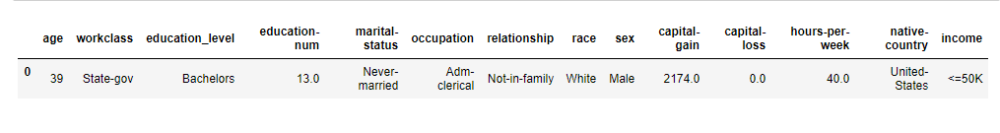

# Machine learning (Supervised learning)
## Finding-Donors-For-Charity-Project:
Description
CharityML is a fictitious charity organization located in the heart of Silicon Valley that was established to provide financial support for people eager to learn machine learning. After nearly 32,000 letters were sent to people in the community, CharityML determined that every donation they received came from someone that was making more than $50,000 annually. To expand their potential donor base, CharityML has decided to send letters to residents of California, but to only those most likely to donate to the charity. With nearly 15 million working Californians, CharityML has brought you on board to help build an algorithm to best identify potential donors and reduce overhead cost of sending mail. Your goal will be evaluate and optimize several different supervised learners to determine which algorithm will provide the highest donation yield while also reducing the total number of letters being sent.

## Project Highlights
This project is designed to get you acquainted with the many supervised learning algorithms available in sklearn, and to also provide for a method of evaluating just how each model works and performs on a certain type of data. It is important in machine learning to understand exactly when and where a certain algorithm should be used, and when one should be avoided.

Things i have learned by completing this project:

- How to identify when preprocessing is needed, and how to apply it.
- How to establish a benchmark for a solution to the problem.
- What each of several supervised learning algorithms accomplishes given a specific dataset.
- How to investigate whether a candidate solution model is adequate for the problem.

### Getting Started
In this project, you will employ several supervised algorithms of your choice to accurately model individuals' income using data collected from the 1994 U.S. Census. You will then choose the best candidate algorithm from preliminary results and further optimize this algorithm to best model the data. Your goal with this implementation is to construct a model that accurately predicts whether an individual makes more than $50,000. This sort of task can arise in a non-profit setting, where organizations survive on donations. Understanding an individual's income can help a non-profit better understand how large of a donation to request, or whether or not they should reach out to begin with. While it can be difficult to determine an individual's general income bracket directly from public sources, we can (as we will see) infer this value from other publically available features.

### data Samles :

### Model results:
- Final Model trained on full data

Accuracy on testing data: 0.8718
F-score on testing data: 0.7545

- Final Model trained on reduced data

Accuracy on testing data: 0.8589
F-score on testing data: 0.7257
